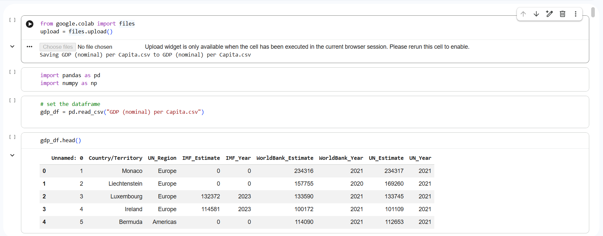

# 🐍 Python
### 🐍 Exploratory Data Analysis with Python

## Overview

This project demonstrates the use of Python to clean, explore, and visualise data within a Google Colab notebook. Using industry-standard Python libraries, I carried out exploratory data analysis (EDA) to better understand the dataset, identify trends, and communicate insights through visualisations.

The project follows a typical data analysis workflow, from importing data and preparing the dataset through to creating meaningful charts and summarising key findings.

---
## Visual

## Objectives

The aim of this project was to:

- Import and prepare a dataset for analysis
- Explore the structure and quality of the data
- Clean and filter the dataset
- Perform exploratory data analysis (EDA)
- Create visualisations to identify patterns and trends

---

## Data Preparation

Before analysing the data, I prepared the dataset by:

- Importing the required Python libraries
- Loading the dataset into Google Colab
- Inspecting the dataset structure
- Checking data types and missing values
- Filtering and cleaning the data where necessary

---

## Python Libraries Used

This project demonstrates the use of:

- Pandas
- NumPy
- Matplotlib
- Seaborn
- Google Colab

---

## Analysis & Visualisations

The notebook includes:

- Dataset exploration
- Data filtering and manipulation
- Summary statistics
- Exploratory data analysis (EDA)
- Charts and graphs to communicate insights
- Interpretation of analytical findings

---

## Skills Demonstrated

- Python Programming
- Google Colab
- Data Cleaning
- Exploratory Data Analysis (EDA)
- Data Manipulation
- Data Visualisation
- Analytical Thinking
- Data Storytelling

---

## Notebook

📓 **View the complete Google Colab notebook:**

[View Colab Notebook](https://github.com/minashahidd/minashahidd/blob/660b2fbced5d2a78e6f09ce7428942a723ac435a/GDP_per_Capita.ipynb)

---

## Tools Used

- Python
- Google Colab
- Pandas
- NumPy
- Matplotlib
- Seaborn
