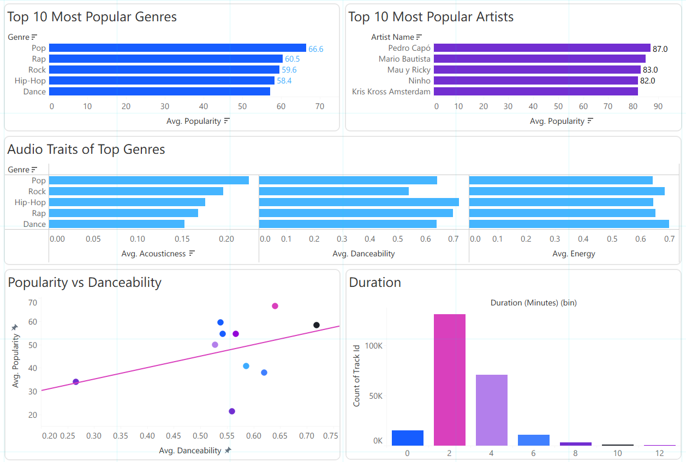
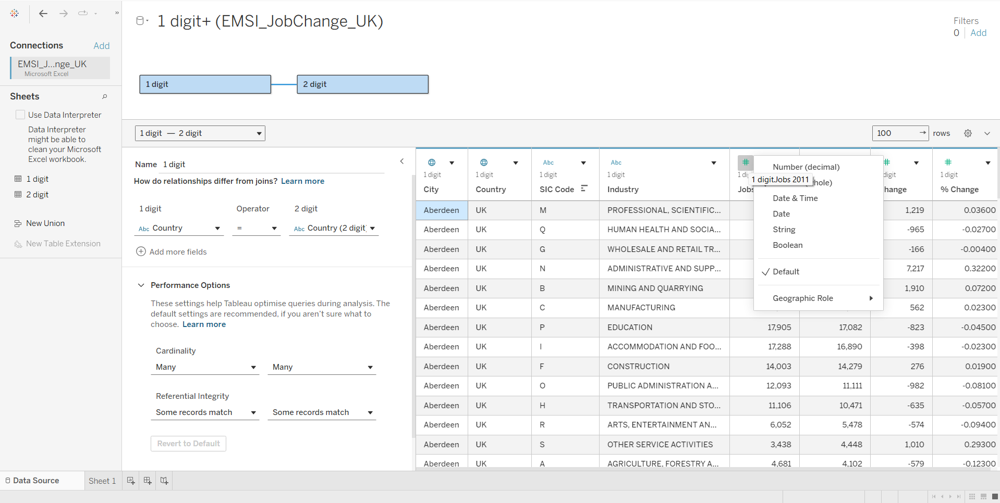

# 📈 Tableau
### 📊 Music Popularity Dashboard with Tableau

## Overview

This project demonstrates the use of Tableau to analyse and visualise a music dataset through a series of static dashboards. After preparing the dataset, I created a collection of visualisations to explore trends in music popularity, genres, artists, and audio characteristics.

The project focuses on communicating insights through effective data visualisation and developing foundational dashboard design skills using Tableau.

---

## Dashboard Preview

> *Click on the image to open the full dashboard.*
---

## Objectives

The aim of this project was to:

- Explore trends within a music dataset
- Compare the popularity of different genres and artists
- Analyse audio characteristics across genres
- Investigate relationships between musical features
- Present findings through clear and informative visualisations

---

## Data Preparation

Before creating the visualisations, I prepared the dataset by:

- Reviewing and cleaning the data
- Organising fields for analysis
- Ensuring the dataset was suitable for visualisation

In a separate Tableau exercise, I also gained experience with:

- Data cleaning
- Creating relationships between tables
- Preparing datasets for analysis

---

## Tableau Features Used

This project demonstrates the use of:

- Dashboard Design
- Bar Charts
- Scatter Plots
- Histograms
- Data Aggregation
- Calculated Fields
- Data Visualisation
- Exploratory Data Analysis (EDA)

---

## Dashboard Features

The dashboard includes:

- Top 10 most popular genres
- Top 10 most popular artists
- Comparison of audio traits across genres
- Popularity vs Danceability analysis
- Track duration distribution

---

## Key Insights

The visualisations identified several interesting trends:

- Pop recorded the highest average popularity among the featured genres.
- Certain artists consistently achieved higher popularity scores than others.
- Danceability showed a positive relationship with popularity.
- Different genres displayed distinct characteristics in acousticness, danceability, and energy.
- Most tracks were concentrated within a typical song duration range.

---

## Skills Demonstrated

- Tableau
- Data Cleaning
- Data Visualisation
- Dashboard Design
- Exploratory Data Analysis (EDA)
- Data Storytelling
- Analytical Thinking

---

## Other Projects

Established relationships between cleaned datasets to create a structured data model, enabling accurate analysis and effective dashboard development in Tableau.
---

## Tools Used

- Tableau

