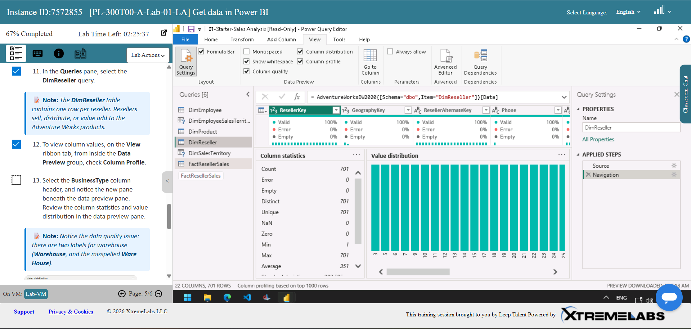

# Hi, I'm Mina 👋

Welcome to my Data Analytics portfolio!

This repository showcases the projects I've completed throughout my Data Analytics Bootcamp. It reflects my journey from learning the fundamentals of data analysis to building interactive dashboards, writing SQL queries, and analysing real-world datasets with Python.

My goal is to continue developing my analytical and technical skills while creating projects that transform data into meaningful insights.

### [📑 My Resume](https://github.com/minashahidd/minashahidd/blob/17414a9a2da8ab8239701c3b192a0cdb77c010b3/Mina%20Shahid%20Data%20Analysis%20CV.pdf)
---

## 🚀 Skills & Projects
> *Select a project below to explore the full documentation, screenshots, and files.*

### [📊 Excel & Data Fundamentals](Projects/Excel/README.md)
Built a strong foundation in data analysis by cleaning and transforming raw datasets, using formulas, PivotTables, charts, and dashboards to produce clear business insights. This project demonstrates practical Excel techniques used for reporting and decision-making.

### [🗄️ SQL & MySQL Workbench](Projects/SQL/README.md)
Developed SQL skills by querying relational databases using filtering, joins, aggregations, subqueries, and date functions. The project showcases how SQL can be used to answer business questions and extract meaningful insights from data.

### [🐍 Python](Projects/Python/README.md)
Used Python to clean, analyse, and visualise datasets with Pandas, NumPy, and Matplotlib. The project includes exploratory data analysis (EDA), data transformation, and visualisations that communicate key findings.

### [📈 Tableau](Projects/Tableau/README.md)
Created interactive dashboards to present trends, comparisons, and performance metrics through effective data storytelling. This project demonstrates dashboard design principles and visual analytics.

### [📊 Power BI](Projects/PowerBI/README.md)
Built end-to-end business intelligence dashboards using Power Query, data modelling, DAX measures, and interactive visualisations. The project highlights how raw data can be transformed into actionable business insights.

---
## Gallery

<table>
  <tr>
    <td align="center">
      
       
      <b>Power BI Interactive Dashboard</b>
    </td>
    <td align="center">
      
       
      <b>SQL Queries</b>
    </td>
  </tr>
  <tr>
    <td align="center">
      
       
      <b>Python Scatter Plot</b>
    </td>
    <td align="center">
      
       
      <b>Power BI Lab</b>
    </td>
  </tr>
</table>

---

## 🛠️ Skills & Tools

- Microsoft Excel
- Python
- Pandas
- NumPy
- Matplotlib
- Seaborn
- SQL
- MySQL Workbench
- Tableau
- Power BI
- Google Colab
- Microsft Azure
- Data Cleaning
- Exploratory Data Analysis (EDA)
- Data Visualisation
- Dashboard Development
- Data Storytelling

---

## 📈 Current Goal

I'm continuously expanding my portfolio by working on new projects that solve real-world business problems using data. As I continue learning, I'll be adding more advanced analytics, visualisations, and end-to-end data projects to this repository.

Thanks for visiting my portfolio!
